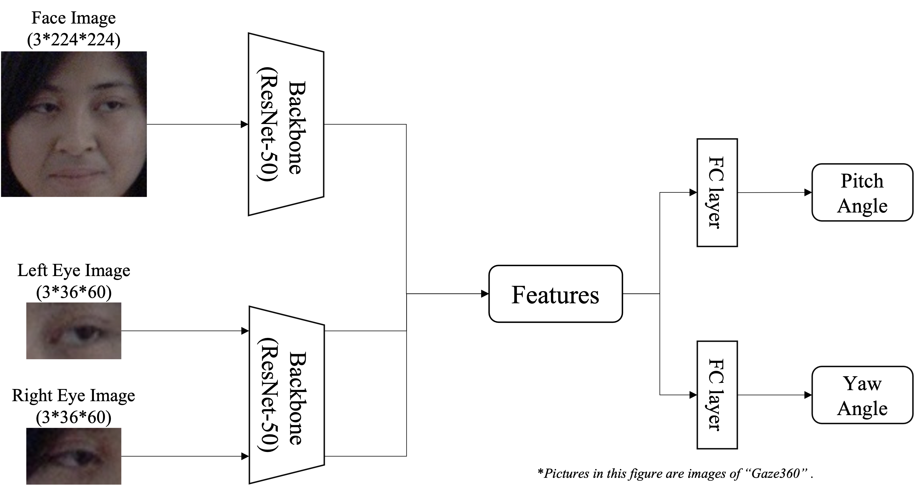

# GazeEstimation_alpha
 

Model for 3D Gaze Estimation based on [L2CS-Net](https://github.com/Ahmednull/L2CS-Net)

## Demo


https://user-images.githubusercontent.com/108858275/218944411-53d906c0-126d-4341-9160-db330dbc94e1.mp4


## OverView
This is an appearance-based 3D gaze estimation method. It is a method to improve the accuracy of the conventional method, L2CS-Net.

To be presented at [IEICE](https://www.ieice-taikai.jp/2023general/jpn/) (as of 2023.02.02).

## Benchmark Performance

Results for the Gaze360 dataset using Mean Angular Error(MAE) as the evaluation index are as follows.

|              | L2CS-Net |    Ours   |
| ------------ | -------- | --------- |
| MAE(degrees) |   10.41  | **10.30** |


## Quick Start
A simple demonstration can be performed using a pre-trained model and a web camera.

- Download the pre-trained models from [here](https://drive.google.com/drive/folders/1DRXqd1nn029LfkTGedLU4UL2JkLx-ebJ?usp=share_link).


```
python demo.py --snapshot "./"
```
Argument: Give the path to the model's weight.

## Usage

### train
```
python train.py --image_dir "./" --label_dir "./"
```
Argument: Give the path to the images and labels in your environment.

### test
```
python test.py --snapshot "./"
```
Argument: Give the path where the model you want to test is stored.

## Requirements
- Ubuntu : 20.04
- Python : 3.7

### Install another packages
```
pip install -r requirements.txt
```

## Introduction
To improve the accuracy of the conventional method, L2CS-Net, we devised a method that uses face and both eye images as input. Our gaze estimation network is shown below. (These images are taken from Gaze360.)




The project contains follwing files/folders.

- `model.py` : the model code.
- `train.py` : the entry for training and validation.
- `test.py` : the entry fot testing.
- `dataset.py` : the data loader code.
- `utils.py` : the utils code.

### DataPreparing
* Dowanload [Gaze360](http://gaze360.csail.mit.edu/) dataset.

* Apply [pre-processing](http://phi-ai.buaa.edu.cn/Gazehub/3D-dataset/) to the dataset.

* The path of the dataset should be `./datasets/Gaze360`.


## Citation
Gaze360:
```
@InProceedings{Kellnhofer_2019_ICCV,
	author = {Kellnhofer, Petr and Recasens, Adria and Stent, Simon and Matusik, Wojciech and Torralba, Antonio},
	title = {Gaze360: Physically Unconstrained Gaze Estimation in the Wild},
	booktitle = {The IEEE International Conference on Computer Vision (ICCV)},
	month = {October},
	year = {2019}
}
```
